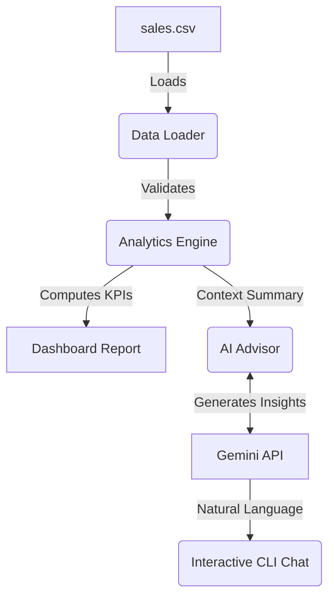

# AI Sales Intelligence Platform


> Enterprise E-Commerce Sales Intelligence Platform that analyzes sales data and provides actionable business insights using Python, Pandas, and Google's Gemini AI.

## 🚀 Features

- **Automated Data Analysis**: Instantly load and validate E-commerce sales CSV files.
- **KPI Engine**: Calculates total revenue, profit, average order value (AOV), and unit volume.
- **Product Rankings**: Identifies best/worst selling products and top performers.
- **Category Insights**: Breaks down revenue and profit by product category.
- **AI Business Consultant**: Interactive terminal chat powered by Gemini AI to answer business queries using your actual data.

## 🛠️ Tech Stack

- **Core**: Python 3.9+
- **Data Processing**: Pandas
- **AI Integration**: Google GenAI SDK (Gemini 2.5)
- **Quality Assurance**: Pytest (Testing), Ruff (Linting & Formatting)

## 🏗️ Architecture



## ⚙️ Installation

1. Clone the repository:
   ```bash
   git clone https://github.com/chetanaybuilder/AI-Sales-Intelligent-Platform.git
   cd AI-Sales-Intelligent-Platform
   ```

2. Create a virtual environment and install dependencies:
   ```bash
   python -m venv venv
   source venv/bin/activate  # On Windows: venv\Scripts\activate
   pip install -e .
   ```

3. Configure your API key:
   ```bash
   cp .env.example .env
   # Edit .env and add your Google Gemini API Key
   ```

## 💻 Quick Start & CLI Examples

The application installs a `sales-ai` command line tool:

1. **View Dashboard**:
   ```bash
   sales-ai --file data/sample_sales.csv dashboard
   ```

2. **Ask a Single Question**:
   ```bash
   sales-ai ask "Which products should I bundle to increase revenue?"
   ```

3. **Interactive AI Consultant Chat**:
   ```bash
   sales-ai chat
   ```

## 📊 Example Questions for AI

- *Which product performs the best?*
- *Which category generates the highest profit margin?*
- *How can I increase overall revenue based on these metrics?*
- *What inventory strategy should I follow for my worst sellers?*

## 🧪 Testing

To run the test suite using pytest:
```bash
pip install -e .[dev]
pytest tests/
```

## 🗺️ Roadmap & Future Improvements

- Streamlit Web Dashboard integration
- Sales Forecasting and Trend Analysis
- PDF / Excel Report Generation
- Customer Segmentation Engine

## 🤝 Contributing

Contributions are welcome! Please feel free to submit a Pull Request. For major changes, please open an issue first to discuss what you would like to change.

## 👤 Author

**Chetanay Batra**
Building AI products and documenting the journey through real-world projects.

## 📄 License

This project is licensed under the MIT License - see the [LICENSE](LICENSE) file for details.
